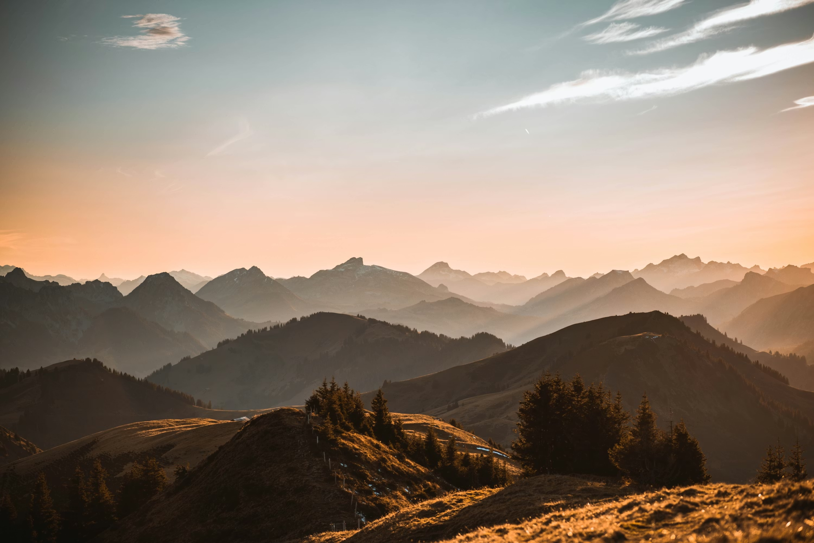
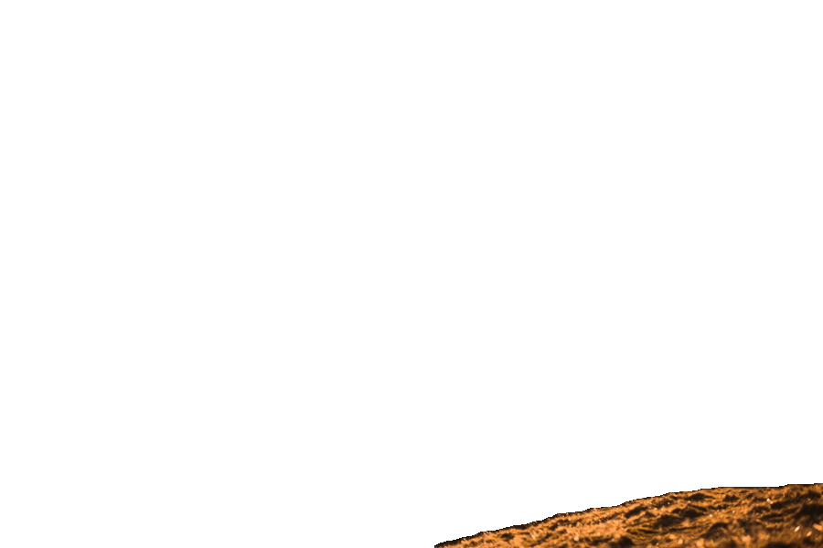

# Parallax Effect — DVS Final Submission

Turn any 2D image into an interactive parallax scene driven by head tracking (webcam) or mouse movement.

## Setup

```bash
pip install flask flask-sock numpy opencv-python-headless scikit-learn Pillow gradio_client
```

## Run

```bash
cd depth-mapper
python web_viewer.py
```

Open http://localhost:5002 in your browser (Chrome recommended for webcam access).

## Usage

- **Head tracking**: Allow camera access — move your head to control the parallax. Move closer/further for zoom effect.
- **Mouse fallback**: If no camera, hover over the parallax canvas to control X/Y. Scroll wheel controls zoom.
- **Upload**: Click "Upload" or "Selfie" in the bottom bar to process your own image (requires internet for HuggingFace depth API).
- **Controls**: Switch between sample images with the dropdown. Toggle "Gap Fill" and adjust "Intensity" slider.

## How it works

### Layer generation pipeline (`depth_processing.py` + `layer_segmentation.py`)

**Stage 1 — Depth Estimation.** The input image is sent to a Depth Anything V2 model (a pre-trained convolutional neural network) deployed on Hugging Face Spaces, returning a per-pixel grayscale depth map (lighter = closer).

**Stage 2 — Resizing.** Both image and depth map are downscaled if needed. The image uses area-based averaging to avoid aliasing (filtering before subsampling prevents high-frequency content folding into false patterns). The depth map uses bilinear interpolation to preserve smooth gradients.

**Stage 3 — Auto-detection of layer count.** A histogram of depth values reveals the distribution of depths in the scene. It is smoothed by repeated convolution with a [1,4,6,4,1] kernel (a binomial approximation of a Gaussian) to suppress noise while preserving dominant modes. Peaks are counted, each corresponds to a natural depth cluster, so the number of layers adapts per image rather than being hardcoded.

**Stage 4 — K-means depth segmentation.** Every pixel is mapped to a feature vector [depth, x, y] and clustered using k-means (assign to nearest centroid by Euclidean distance, recompute means, iterate until convergence). Including spatial coordinates penalises splitting contiguous regions with slightly varying depth, reducing thin sliver artefacts. Clusters are sorted by mean depth to establish back-to-front ordering.

**Stage 5 — Label map cleaning.** A box (averaging) filter is applied to each label's binary presence map and pixels are reassigned to the highest-scoring label, a spatial majority vote that smooths jagged boundaries. Then connected components (8-connectivity) are extracted to find isolated fragments; small ones are dilated to identify their surrounding labels and reassigned to the dominant neighbour, eliminating scattered specks.

**Stage 6 — Morphological mask refinement.** Using a 5×5 elliptical structuring element: morphological closing (dilation then erosion) fills internal holes in each mask; erosion on background layers pulls boundaries inward to prevent overlap at depth transitions; dilation on foreground layers expands boundaries outward to pre-fill strips that would appear as empty gaps during parallax shifting.

**Stage 7 — RGBA layer extraction.** Each mask is combined with the original image to produce an RGBA array (opaque where active, transparent elsewhere), giving a depth-ordered layer stack ready for the parallax renderer.

### Parallax renderer (`compositing.py` / `web_viewer.py`)

_— to be completed by teammate_

---

## Results

### Original image, depth map, and layers

**Mountains** — 4 layers auto-detected



| Layer 0 (background)                                   | Layer 1                                                | Layer 2                                                | Layer 3 (foreground)                                   |
| ------------------------------------------------------ | ------------------------------------------------------ | ------------------------------------------------------ | ------------------------------------------------------ |
|  |  |  |  |

### Parallax in action

> TODO: embed GIF or screen recording of the parallax viewer. Either screen-record `web_viewer.py` in the browser, or add an export step to `depth_processing.py` that captures a few frames at different mouse positions.

---

## Features

- **Head-tracked parallax** — webcam feeds head position in real time; moving your head left/right/up/down shifts layers at depth-proportional speeds, producing the illusion of 3D depth without a headset.
- **Mouse fallback** — full parallax control via mouse hover when no camera is available; scroll wheel controls zoom.
- **Automatic depth segmentation** — the pipeline estimates how many layers the scene naturally contains from its depth histogram, then uses spatial k-means to cut clean, contiguous regions rather than thin noisy slices.
- **Morphological mask refinement** — closing, erosion, and dilation passes clean mask edges and pre-fill the gaps that parallax shifting would otherwise expose.
- **Gap infilling** — a toggle in the viewer reconstructs occluded background regions so moving layers don't reveal transparent holes.
- **Custom image upload** — any image can be dropped in via the browser UI; depth estimation runs automatically via the HuggingFace API and layers are generated on the fly.

---

## Evaluation

**Works well on:**

- Scenes with clear foreground/background separation — portraits, objects on tables, animals against simple backgrounds.
- Images where the depth model produces confident, noiseless gradients with distinct depth modes in the histogram.

**Struggles with:**

- **Continuous depth gradients** — a long corridor or landscape with no natural depth breaks produces uniform histogram distributions; the layer count auto-detects low and the parallax shift is subtle.
- **Transparent and reflective surfaces** — depth models trained on standard scenes predict unreliable depth for glass, mirrors, and water, producing noisy or inverted depth values.
- **Fine structures** — hair, fences, and foliage have sub-pixel depth variation that the model smears; mask boundaries cut through strands rather than around them, leaving fringe artefacts.
- **Very similar depth layers** — when adjacent layers differ by only a few depth values, k-means placement is sensitive to initialisation and can produce uneven splits.
