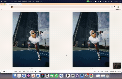
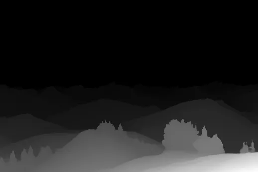
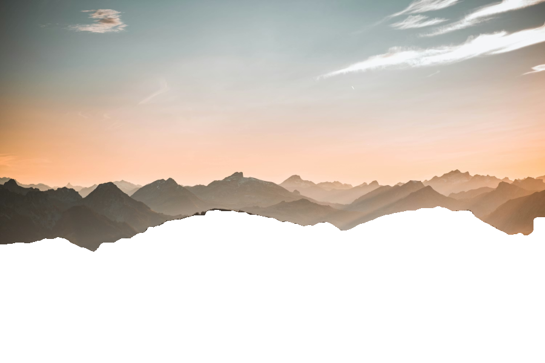
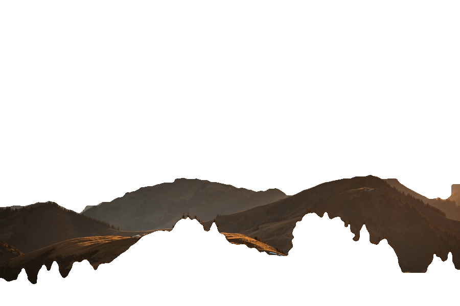
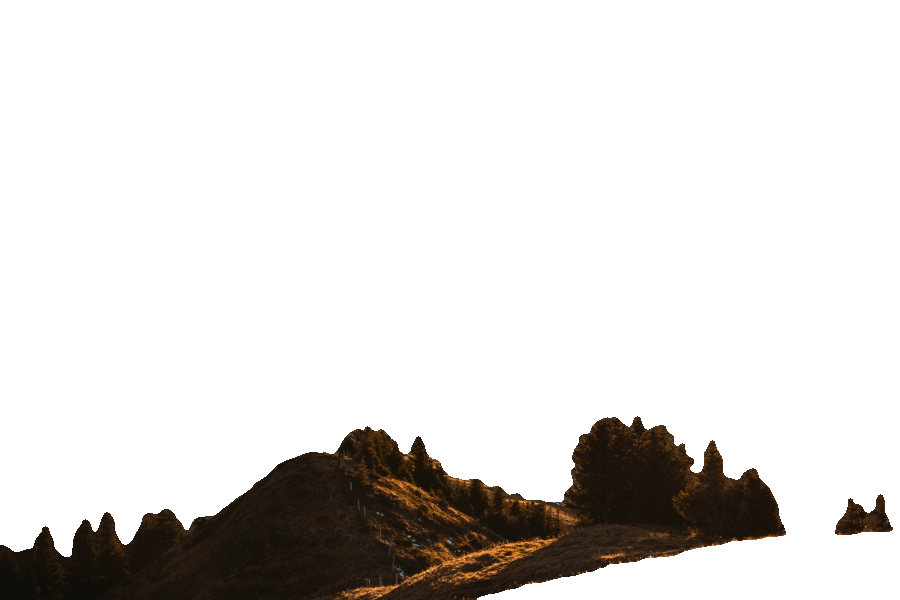
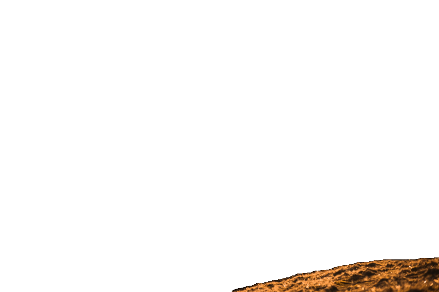
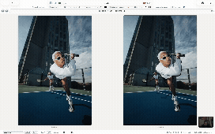

# Parallax Effect — DVS Final Submission



Turn any 2D image into an interactive parallax scene driven by head tracking (webcam) or mouse movement.

## Setup

```bash
pip install flask flask-sock numpy opencv-python-headless scikit-learn Pillow gradio_client
```

## Run

```bash
python app.py
```

Open http://localhost:5002 in your browser (Chrome recommended for webcam access).

## Usage

- **Head tracking**: Allow camera access — move your head to control the parallax. Move closer/further for zoom effect.
- **Mouse fallback**: If no camera, hover over the parallax canvas to control X/Y. Scroll wheel controls zoom.
- **Upload**: Click "Upload" or "Selfie" in the bottom bar to process your own image (requires internet for HuggingFace depth API).
- **Controls**: Switch between sample images with the dropdown. Toggle "Gap Fill" and adjust "Intensity" slider.

## How it works

### Layer generation pipeline (`depth_processing.py` + `layer_segmentation.py`)

**Stage 1 — Depth Estimation.** The input image is sent to a Depth Anything V2 model (a pre-trained convolutional neural network) deployed on Hugging Face Spaces, returning a per-pixel grayscale depth map (lighter = closer).

**Stage 2 — Resizing.** Both image and depth map are downscaled if needed. The image uses area-based averaging to avoid aliasing (filtering before subsampling prevents high-frequency content folding into false patterns). The depth map uses bilinear interpolation to preserve smooth gradients.

**Stage 3 — Auto-detection of layer count.** A histogram of depth values reveals the distribution of depths in the scene. It is smoothed by repeated convolution with a [1,4,6,4,1] kernel (a binomial approximation of a Gaussian) to suppress noise while preserving dominant modes. Peaks are counted, each corresponds to a natural depth cluster, so the number of layers adapts per image rather than being hardcoded.

**Stage 4 — K-means depth segmentation.** Every pixel is mapped to a feature vector [depth, x, y] and clustered using k-means (assign to nearest centroid by Euclidean distance, recompute means, iterate until convergence). Including spatial coordinates penalises splitting contiguous regions with slightly varying depth, reducing thin sliver artefacts. Clusters are sorted by mean depth to establish back-to-front ordering.

**Stage 5 — Label map cleaning.** A box (averaging) filter is applied to each label's binary presence map and pixels are reassigned to the highest-scoring label, a spatial majority vote that smooths jagged boundaries. Then connected components (8-connectivity) are extracted to find isolated fragments; small ones are dilated to identify their surrounding labels and reassigned to the dominant neighbour, eliminating scattered specks.

**Stage 6 — Morphological mask refinement.** Using a 5×5 elliptical structuring element: morphological closing (dilation then erosion) fills internal holes in each mask; erosion on background layers pulls boundaries inward to prevent overlap at depth transitions; dilation on foreground layers expands boundaries outward to pre-fill strips that would appear as empty gaps during parallax shifting.

**Stage 7 — RGBA layer extraction.** Each mask is combined with the original image to produce an RGBA array (opaque where active, transparent elsewhere), giving a depth-ordered layer stack ready for the parallax renderer.

### Real-time rendering (`viewer.html` → `app.py` → `compositing.py`)

The three files form a loop that runs every frame:

**Stage 8 — Head tracking** (`viewer.html`). MediaPipe Face Mesh detects 468 facial landmarks per frame from the webcam. The face centre is normalised to (x, y, z) where Z is derived from face size as a distance proxy. Positions are smoothed with exponential moving average to suppress jitter and sent to the server over WebSocket. Mouse/scroll serves as fallback input.

**Stage 9 — Shift calculation** (`app.py`). The server computes each layer's pixel shift proportional to its depth index (`dx = -x × PARALLAX_STRENGTH × depth_weight`). Deeper layers shift less, nearer layers shift more. The Z component maps to a per-layer scale factor for dolly zoom. These shifts are passed to `compositing.py`.

**Stage 10 — Compositing** (`compositing.py`). Each layer is translated and scaled using a 2×3 transformation matrix, then blended back-to-front with alpha compositing. During blending, a coverage buffer tracks how much each pixel has been covered. After all layers are composited, any pixel with coverage below 0.99 is a gap. These gaps are filled using the Telea inpainting algorithm, which traverses outward from gap edges in a BFS-like order, computing each missing pixel's colour as a distance-weighted average of its known neighbours. The result is a single composited image.

**Transformation matrix.** Each layer is shifted and scaled by a 2×3 matrix:

```
M = [[scale,  0,     dx],
     [0,      scale, dy]]
```

Column 1 and 2 control X/Y scaling, column 3 controls X/Y translation. This tells each pixel: move by (dx, dy) and scale by the given factor, all in one operation.

**Alpha compositing.** Each layer only covers part of the image — the rest is transparent (alpha = 0). Alpha compositing uses the alpha channel to decide which pixels to draw and which to skip, so transparent regions let the layers behind show through instead of appearing as black. Layers are blended one at a time from the farthest background to the nearest foreground, producing the final composited frame.

**Gap inpainting.** Gaps are filled by OpenCV's `cv2.inpaint(image, mask, radius, cv2.INPAINT_TELEA)`:

- `image` — the composited frame with gaps
- `mask` — binary mask marking which pixels are gaps (coverage < 0.99)
- `radius` — how far (in pixels) the algorithm looks for known pixels to fill from (set to 5)
- `INPAINT_TELEA` — selects the Telea algorithm

The algorithm works like BFS: it starts from the edges of each gap where known pixels exist, then fills inward one pixel at a time. Each missing pixel's colour is computed as a weighted average of its known neighbours, with closer neighbours weighted more heavily. This produces a smooth fill that extends the surrounding colours into the gap.
**Stage 11 — Streaming** (`app.py`). The composited image is encoded as JPEG and sent back over WebSocket. If the head hasn't moved enough since the last frame, the cached JPEG is reused to save CPU.

---

## Results

### Original image, depth map, and layers

**Mountains** — 4 layers auto-detected

| Original                                   | Depth map                                           |
| ------------------------------------------ | --------------------------------------------------- |
|  |  |

| Layer 0 (background)                        | Layer 1                                     | Layer 2                                     | Layer 3 (foreground)                        |
| ------------------------------------------- | ------------------------------------------- | ------------------------------------------- | ------------------------------------------- |
|  |  |  |  |

### Parallax in action



---

## Features

- **Head-tracked parallax** — webcam feeds head position in real time; moving your head left/right/up/down shifts layers at depth-proportional speeds, and moving closer/farther scales layers to simulate dolly zoom, producing the illusion of 3D depth without a headset.
- **Mouse fallback** — full parallax control via mouse hover when no camera is available; scroll wheel controls zoom.
- **Automatic depth segmentation** — the pipeline estimates how many layers the scene naturally contains from its depth histogram, then uses spatial k-means to cut clean, contiguous regions rather than thin noisy slices.
- **Morphological mask refinement** — closing, erosion, and dilation passes clean mask edges and pre-fill the gaps that parallax shifting would otherwise expose.
- **Gap infilling** — enabled by default, reconstructs occluded background regions so moving layers don't reveal transparent holes. Can be toggled on/off in the viewer.
- **Custom image upload** — any image can be dropped in via the browser UI; depth estimation runs automatically via the HuggingFace API and layers are generated on the fly.

---

## Evaluation

**Works well:**

- **Head tracking** — MediaPipe Face Mesh is highly robust across different lighting conditions, face angles, and distances. Tracking rarely drops even with partial occlusion or fast movement.
- **Shift calculation** — the per-layer depth-proportional shifting produces a convincing parallax effect. The exponential smoothing eliminates jitter while keeping the response feeling immediate.
- **Depth segmentation** — scenes with clear foreground/background separation (portraits, objects on tables, animals against simple backgrounds) produce clean layer boundaries with distinct depth modes in the histogram.

**Struggles with:**

- **Continuous depth gradients** — a long corridor or landscape with no natural depth breaks produces uniform histogram distributions; the layer count auto-detects low and the parallax shift is subtle.
- **Transparent and reflective surfaces** — depth models trained on standard scenes predict unreliable depth for glass, mirrors, and water, producing noisy or inverted depth values.
- **Fine structures** — hair, fences, and foliage have sub-pixel depth variation that the model smears; mask boundaries cut through strands rather than around them, leaving fringe artefacts.
- **Very similar depth layers** — when adjacent layers differ by only a few depth values, k-means placement is sensitive to initialisation and can produce uneven splits.
- **Limited depth map resolution** — Depth Anything V2 outputs at a fixed resolution (typically 518×518), so high-resolution input images are downscaled before depth estimation. The depth map is then upscaled back to the original size, which can introduce blurriness and loss of fine edge detail in the segmented layers.
- **Real-time compositing performance** — every frame is composited server-side in Python (NumPy + OpenCV), which is significantly slower than GPU-based rendering. With more layers or higher resolution images, frame rate drops noticeably. The WebSocket round-trip (browser → server → composite → JPEG encode → browser) adds further latency compared to a purely client-side approach.

---

## Personal Reflection & Contribution

For personal reflections and a detailed breakdown of individual contributions, see our shared Notion page:

🔗 [Personal Reflection & Contribution (Notion)](https://www.notion.so/Personal-Reflection-329e1efacd848067a73ae87ad82ebfbb?source=copy_link)
